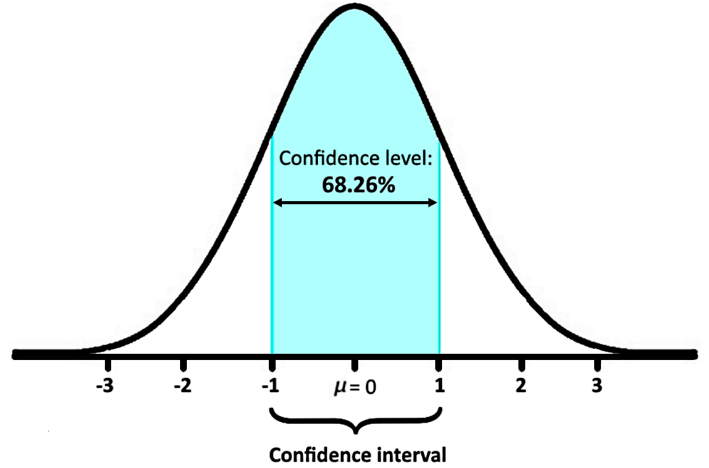

# Your model is not as good as you think. Or maybe it is. Without uncertainty, you cannot tell.


Machine learning (ML) teams love clean numbers: **Accuracy of 92%**, **RMSE of 3.4**, **F1-score of 0.88**. Those values are useful, but they are estimates derived from finite data, noisy labels, and design choices (thresholds, sampling, preprocessing). Treating a single point estimate as definitive encourages overconfidence and leads to bad decisions, shipping unreliable models, missing regressions in minority groups, or chasing noise during model selection.

Confidence intervals (CI) change that conversation. They convert a point metric into a quantified range that captures sampling variability, measurement noise, and model sensitivity to operational choices. That transforms evaluation from a summary statistic into a decision tool: you can translate metric uncertainty into business risk, set deployment gates with clear tolerance, and prioritize work where uncertainty is large.

This post explains why CI is practical (not just statistical), where naive approaches commonly fail, and how Infer approaches CI computation in a metric-aware, production-ready way. We'll show how to pick the right method, interpret intervals for operational decisions, and integrate CI into model monitoring and comparisons.

## Why confidence intervals matter in ML



A single metric value answers one question: *what did my model do on this sample?* It does not tell you how much that value might change if the sample, threshold, or data distribution shifts.

Confidence intervals convert a point estimate into an interval that captures sampling variability, measurement noise, and estimation uncertainty. That change is practical, not academic. It directly affects decisions:

- **Translate metrics into business risk:** A confidence interval shows how metric variation maps to user-facing outcomes or cost functions at decision thresholds.
- **Prevent spurious wins from selection:** confidence intervals expose when apparent improvements from hyperparameter search or leaderboard selection are within noise.
- **Enable robust deployment and monitoring:** Use intervals to distinguish expected fluctuation from real performance degradation or data drift.
- **Reveal subgroup instability:** confidence intervals make it easier to find fragile behavior across demographics or edge cases, aiding fairness and compliance.
- **Improve communication and accountability:** Intervals give stakeholders a calibrated view of confidence, not a single, overconfident number.

## Where point metrics fail in practice 

Point estimates assume your test set perfectly represents reality. In practice, this assumption almost never holds.

#### 1. Small test sets

When evaluation sets are small, variance dominates. A model evaluated on 200 samples may appear “better” purely by chance.

For example:
* Accuracy = 91.8% on 200 samples
* One additional error drops accuracy by 0.5%

Without confidence intervals, teams routinely overinterpret these fluctuations as real improvements.

#### 2. Imbalanced classification

In domains like fraud detection, medical diagnosis, or anomaly detection, the minority class matters most. Metrics such as recall, precision, and F1-score can vary wildly with small changes in data composition.

Confidence intervals reveal when minority-class performance is statistically unstable, even if the mean metric looks acceptable.

#### 3. Hyperparameter tuning and selection bias

When dozens or hundreds of models are tried, the “best” metric is often just the luckiest one. confidence interval exposes when improvements fall within noise rather than signal.

If you try enough models, one will look better. Confidence intervals help you tell whether it actually is.

## Confidence intervals in real domains

**Healthcare example**

A diagnostic model reports 94% sensitivity on a test set.

With confidence intervals:
* Sensitivity = 94%
* 95% CI = [87%, 98%]

That lower bound matters. In healthcare, missing 13 diagnoses per 100 patients may be unacceptable. Without CI, this risk is invisible.

**A/B testing analogy** 

In online A/B testing, confidence intervals are standard. Teams would never ship a change based on point estimates alone.
Offline ML evaluation answers the same question:

Is this difference real, or just noise?

Confidence intervals bring the same statistical discipline to offline model evaluation.

## Introducing Infer

**Infer** is a Python-based evaluation framework designed to compute confidence intervals for evaluation metrics in a standardized, reliable, and extensible way.

### What makes Infer different

Infer treats confidence-interval computation as a metrics-first engineering problem rather than a generic statistics utility. Instead of a single, generic function, Infer embeds metric-aware decision logic and production-ready outputs:

- **Uses metric-aware methods:** Implements and selects statistically appropriate procedures (DeLong and Takahashi for ROC-AUC, analytical intervals for proportions, bootstrap fallbacks when asymptotic assumptions fail).
- **Encodes practical edge-case handling:** Small-sample corrections, imbalanced-class behavior, zero-division guards, and sensible fallbacks so evaluations don't break in real datasets.
- **Consistent, programmatic API:** A single evaluator returns metric, CI, chosen method, and diagnostic metadata, which makes automation, comparison, and monitoring straightforward.
- **Reproducible and validated:** Deterministic bootstrap seeding and unit tests that compare results to reference implementations and published methods.
- **Actionable reporting & visualization:** Structured outputs and built-in visualizations of resampling distributions make uncertainty explorable and communicable.
- **Extensible for production:** A pluggable design lets teams add new metric-specific methods and integrate Infer into CI/CD and monitoring pipelines.

These design decisions make Infer safer and more actionable than blindly importing a generic CI routine: it chooses the right statistical tool for each metric, documents that choice, and returns machine-readable results you can trust in production.

At its core, Infer supports:

- Classification metrics like **Accuracy, Precision, Recall, F1-score, ROC-AUC**
- Regression metrics like **MAE, RMSE, MAPE**
- Multiple CI estimation methods including analytical and bootstrap-based approaches
- Automatic method selection based on metric and data characteristics
- Visual outputs that make uncertainty transparent and actionable

This design is rooted on a clear observation: CI computation is inconsistent across ML teams, even though robust statistical methods are well-known and proven.

## Example Usage

```python
from confidenceinterval import MetricEvaluator 
import pandas as pd

# Load your data
df = pd.read_csv('data.csv')
y_true = df['actual_values']
y_pred = df['predictions']

# Initialize the evaluator
evaluator = MetricEvaluator()

# Evaluate regression metric with confidence interval
mape, ci = evaluator.evaluate(
    y_true=y_true, l
    y_pred=y_pred, 
    task='regression', 
    metric='mape',
    method='bootstrap',  # or 'analytical' for faster computation
    n_bootstraps=10000,   # number of bootstrap samples
    confidence_level=0.95 # 95% confidence
    # plot=True  # Uncomment to visualize the distribution
)

```

**The result:**

- MAPE of 7.88%
- 95% confidence interval of [6.47%, 9.84%]
- Corresponding accuracy interpretation of 92.12% with a well-defined uncertainty range

This gives far more insight than a single error number. It tells you not just how well the model performed, but how stable that performance is under resampling and noise.

